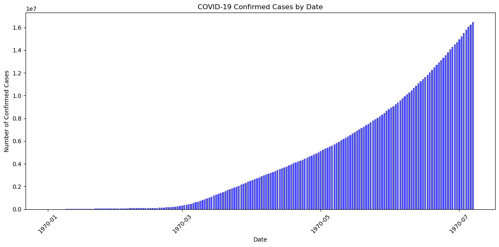

# COVID-19 Global Data Analysis
Here’s a **GitHub-ready README.md text** you can use for your COVID-19 Global Data Analysis project:

---

# COVID-19 Global Data Analysis

## 📌 Project Overview

This project performs **Exploratory Data Analysis (EDA)**, feature engineering, and basic statistical analysis on COVID-19 global datasets.
It covers visualizations, statistical summaries, and probability-based insights to better understand the spread and severity of COVID-19 worldwide.

---

## 📂 Dataset

* **Source**: COVID-19 global dataset (https://www.kaggle.com/datasets/imdevskp/corona-virus-report)
* **Main Columns**:

  * `Date` – Reporting date
  * `Country/Region` – Country name
  * `Confirmed` – Total confirmed cases
  * `Deaths` – Total death count
  * `Recovered` – Total recovered count
  * `Continent` – Continent name

---

## 📊 Part 2 – Exploratory Data Analysis (EDA)

### 1️⃣ Histogram of Confirmed Cases

Shows the distribution of confirmed COVID-19 cases across countries.


### 2️⃣ Top 10 Countries by Confirmed Cases (Latest Date)

Ranks countries with the highest number of confirmed cases.


---

### 3️⃣ Top 10 Countries by Death Count (Latest Date)

Ranks countries with the highest number of reported deaths.


---

### 4️⃣ Scatter Plot – Confirmed vs Deaths

Shows the relationship between confirmed cases and death counts.


---

### 5️⃣ Time Series – Confirmed Cases in India

Visualizes the trend of confirmed cases in India over time.


---

### 6️⃣ Bar Chart – Total Confirmed Cases by Continent

Manually grouped total confirmed cases per continent.


## 📦 Requirements

Install dependencies:

```bash
pip install pandas matplotlib seaborn numpy
```

---

## ▶️ Running the Project

```bash
python covid_analysis.py
```

or run the Jupyter Notebook:

```bash
jupyter notebook covid-analysis.ipynb
```

---

Do you want me to also **generate a README with actual image links from your code outputs**, so it’s ready to push to GitHub with visuals included? That would make it much more engaging.
